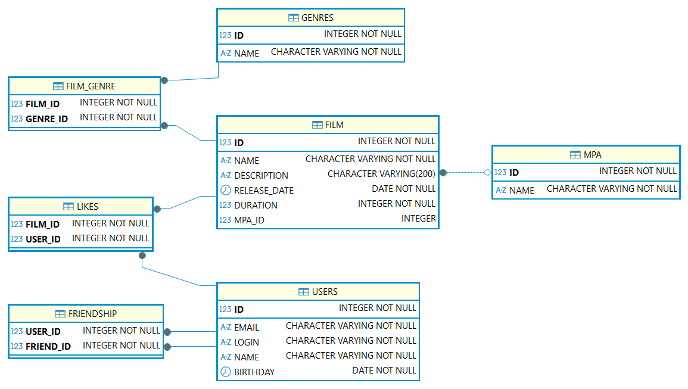

# java-filmorate
Template repository for Filmorate project.

Примеры запросов:
Запрос фильма с жанрами и рейтингом
SELECT ff.ID, ff.NAME, ff.DESCRIPTION, ff.RELEASE_DATE, ff.DURATION, m.ID as MPA_ID,m.NAME as MPA_NAME, g.ID AS GENRE_ID, g.NAME as GENRE_NAME FROM
(SELECT * FROM PUBLIC.FILM f WHERE id = :id) AS ff 
LEFT JOIN PUBLIC.FILM_GENRE fg  
ON ff.ID = fg.FILM_ID 
LEFT JOIN PUBLIC.MPA m 
ON ff.MPA_ID = m.ID 
LEFT JOIN PUBLIC.GENRES g 
ON fg.GENRE_ID = g.ID;

Создание записи фильма в БД:
INSERT INTO PUBLIC.FILM (NAME, DESCRIPTION, RELEASE_DATE, DURATION, MPA_ID) 
    VALUES (:name, :description, :releasedate, :duration, :mpa_id)

Обновление записи фильма в БД:
UPDATE PUBLIC.FILM SET NAME=:name, DESCRIPTION=:description,
    RELEASE_DATE=:releasedate, DURATION=:duration, MPA_ID=:mpa_id WHERE ID=:id